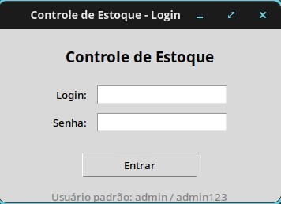
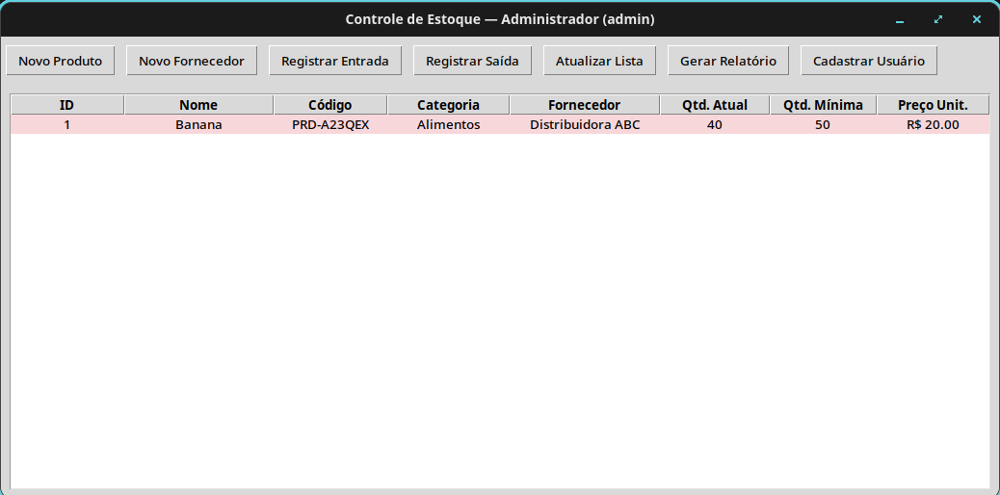
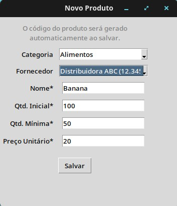
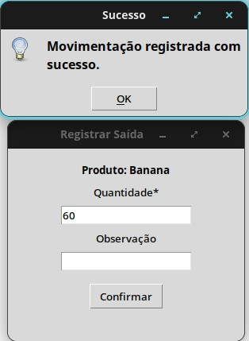
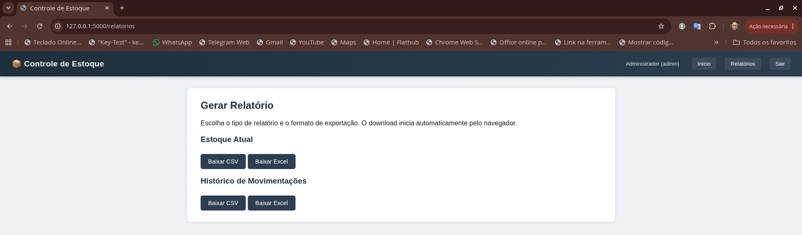
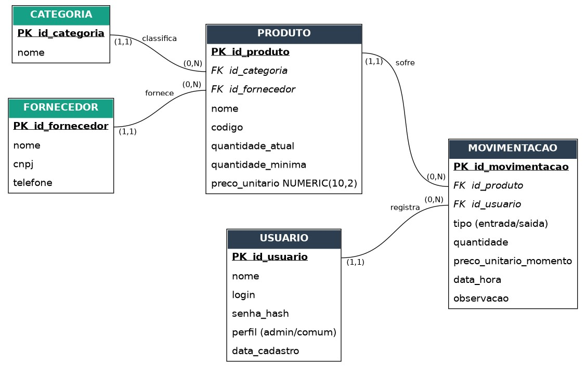
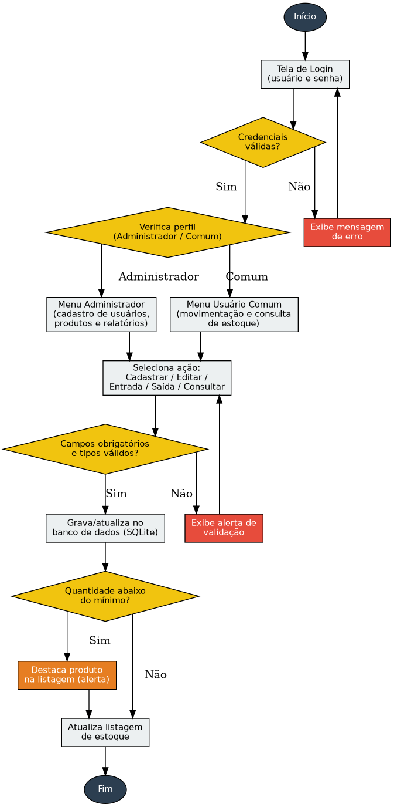

# Sistema de Controle de Estoque

Aplicação de controle de estoque desenvolvida em Python, com duas interfaces de uso: uma aplicação desktop construída com Tkinter e uma aplicação web desenvolvida com Flask. O projeto compartilha as mesmas regras de negócio e um banco de dados SQLite entre as duas interfaces, permitindo gerenciar produtos, categorias, fornecedores e movimentações de entrada e saída de estoque.

---

## Português

### Sobre o projeto

O Sistema de Controle de Estoque foi desenvolvido como projeto acadêmico da disciplina **Development with Python**, do Centro Universitário UniFECAF.

A aplicação demonstra o uso de Python em um sistema integrado de gerenciamento de estoque, reunindo:

- Interface desktop com Tkinter
- Interface web com Flask
- Banco de dados SQLite
- Autenticação de usuários e controle de permissões
- Cadastro de produtos, categorias e fornecedores
- Registro de entradas e saídas de estoque
- Relatórios de estoque
- Exportação de dados para CSV e Excel

As interfaces desktop e web operam sobre a mesma camada de regras de negócio, garantindo consistência entre os dados manipulados por qualquer uma delas.

### Objetivos

- Desenvolver uma aplicação prática utilizando Python
- Aplicar conceitos de programação orientada a objetos
- Trabalhar com banco de dados SQLite
- Implementar autenticação e controle de acesso
- Organizar regras de negócio em módulos reutilizáveis
- Criar interfaces desktop e web integradas
- Registrar e consultar movimentações de estoque
- Gerar relatórios para análise de dados
- Aplicar conceitos de modelagem de dados e organização de sistemas

### Funcionalidades

**Autenticação**
- Tela de login com validação de usuário e senha
- Perfis de administrador e usuário comum, com controle de acesso conforme o perfil
- Senhas armazenadas com hash SHA-256

**Produtos**
- Cadastro, alteração, exclusão e consulta de produtos
- Controle de quantidade em estoque e definição de estoque mínimo
- Associação com categorias e fornecedores

**Categorias**
- Cadastro, alteração, exclusão e consulta de categorias

**Fornecedores**
- Cadastro, alteração, exclusão e consulta de fornecedores

**Movimentações de estoque**
- Registro de entradas e saídas, com data e produto associados
- Atualização automática da quantidade disponível
- Controle do estoque mínimo

**Relatórios**
- Consulta do estoque atual e do histórico de movimentações
- Exportação para CSV e Excel, usando `pandas` e `openpyxl`

### Tecnologias utilizadas

Python 3 · Tkinter · Flask · SQLite · Pandas · OpenPyXL · HTML · CSS · Jinja2 · SHA-256

### Estrutura do projeto

```text
SISTEMA-DE-CONTROLE-DE-ESTOQUE/
│
├── database/
│   └── estoque.db
│
├── models/
│   ├── categoria.py
│   ├── fornecedor.py
│   ├── movimentacao.py
│   ├── produto.py
│   └── usuario.py
│
├── templates/
│   ├── base.html
│   ├── login.html
│   ├── index.html
│   ├── produtos.html
│   ├── categorias.html
│   ├── fornecedores.html
│   └── movimentacoes.html
│
├── static/
│   ├── css/
│   └── js/
│
├── main.py
├── webapp.py
├── requirements.txt
├── README.md
├── tela-login.png
├── tela-principal.png
├── cadastro-produtos.png
├── movimentacao-estoque.png
├── relatorios.png
├── modelo-banco-dados.png
└── fluxograma-logica.png
```

> A estrutura pode variar conforme a versão do projeto e os arquivos presentes no repositório.

### Como executar

**Aplicação desktop** (Tkinter):

```bash
python main.py
```

**Aplicação web** (Flask):

```bash
python webapp.py
```

Após iniciar a aplicação web, acesse:

```text
http://127.0.0.1:5000
```

### Demonstração visual

As imagens ficam na raiz do repositório.

| Tela | Descrição |
|---|---|
|  | Tela de login |
|  | Tela principal, com alerta de estoque abaixo do mínimo |
|  | Cadastro de produtos |
|  | Movimentação de estoque |
|  | Relatórios (interface web) |
|  | Modelo Entidade-Relacionamento (ER) do banco de dados |
|  | Fluxograma da lógica da aplicação |

### Instalação

```bash
git clone https://github.com/Sponge1774/SISTEMA-DE-CONTROLE-DE-ESTOQUE.git
cd SISTEMA-DE-CONTROLE-DE-ESTOQUE

python -m venv venv

# Linux/macOS
source venv/bin/activate
# Windows
venv\Scripts\activate

pip install -r requirements.txt
```

Se o `requirements.txt` ainda não existir, instale manualmente as dependências principais:

```bash
pip install pandas openpyxl flask
```

### Credenciais padrão

```text
Usuário: admin
Senha: admin123
```

> Recomenda-se alterar a senha padrão antes de qualquer uso além do ambiente acadêmico/de testes.

### Banco de dados

Armazenado em `database/estoque.db` (SQLite), com as tabelas principais:

- `usuario`
- `categoria`
- `fornecedor`
- `produto`
- `movimentacao`

**Relacionamentos:**
- Um usuário pode realizar várias movimentações
- Uma categoria pode estar associada a vários produtos
- Um fornecedor pode fornecer vários produtos
- Um produto pode possuir várias movimentações
- Cada movimentação está relacionada a um produto

### Segurança

Mecanismos implementados:
- Autenticação e controle de permissões
- Separação entre administrador e usuário comum
- Senhas com hash SHA-256
- Validação das operações de cadastro

Por se tratar de um projeto acadêmico, para uso em produção recomenda-se adicionar:
- Hash de senha com Argon2 ou bcrypt
- Controle de sessão mais robusto
- Proteção contra CSRF
- Validação avançada de entradas
- Registro de logs e controle de tentativas de login
- Configuração via variáveis de ambiente

### Sincronização entre interfaces

Desktop e web compartilham as mesmas regras de negócio e o mesmo banco SQLite. A atualização dos dados depende da consulta/recarregamento na interface em uso — não há atualização em tempo real entre elas (ver "Melhorias futuras").

### Melhorias futuras

- Atualização em tempo real entre interfaces
- API REST
- Migração para PostgreSQL ou MySQL
- Gráficos de movimentação e dashboard administrativo
- Controle de estoque por localização
- Cadastro de usuários e recuperação de senha pela interface
- Relatórios em PDF
- Testes automatizados
- Docker e deploy em servidor
- Interface responsiva aprimorada
- Níveis de permissão mais detalhados

### Documentação acadêmica

O projeto foi acompanhado de documentação teórica e técnica cobrindo descrição do sistema, objetivos, tecnologias, modelagem do banco de dados, funcionalidades, regras de negócio, estrutura das tabelas, segurança e melhorias futuras.

**Autor:** Eduardo Souza Mattos
**R.A.:** 35984
**Instituição:** Centro Universitário UniFECAF
**Curso:** Análise e Desenvolvimento de Sistemas
**Disciplina:** Development with Python
**Ano:** 2026

### Licença

Projeto desenvolvido para fins acadêmicos e educacionais.

---

## English

### About the project

The Inventory Control System was developed as an academic project for the **Development with Python** course at Centro Universitário UniFECAF.

The application demonstrates the use of Python in an integrated inventory management system, including:

- Tkinter desktop interface
- Flask web interface
- SQLite database
- User authentication and access control
- Product, category, and supplier management
- Stock entry and exit registration
- Inventory reports
- CSV and Excel data export

Both interfaces run on the same business-rule layer, ensuring consistent data regardless of which one is used.

### Objectives

- Develop a practical application using Python
- Apply object-oriented programming concepts
- Work with an SQLite database
- Implement authentication and access control
- Organize business rules into reusable modules
- Build integrated desktop and web interfaces
- Register and query stock movements
- Generate reports for data analysis
- Apply data modeling and system organization concepts

### Features

**Authentication**
- Login screen with username/password validation
- Administrator and common-user profiles with role-based access control
- Passwords stored using SHA-256 hashing

**Products**
- Registration, editing, deletion, and search
- Stock quantity control and minimum stock threshold
- Category and supplier association

**Categories**
- Registration, editing, deletion, and search

**Suppliers**
- Registration, editing, deletion, and search

**Stock movements**
- Entry and exit registration with date and associated product
- Automatic update of available quantity
- Minimum stock control

**Reports**
- Current inventory and movement history queries
- CSV and Excel export using `pandas` and `openpyxl`

### Technologies

Python 3 · Tkinter · Flask · SQLite · Pandas · OpenPyXL · HTML · CSS · Jinja2 · SHA-256

### Project structure

```text
SISTEMA-DE-CONTROLE-DE-ESTOQUE/
│
├── database/
│   └── estoque.db
│
├── models/
│   ├── categoria.py
│   ├── fornecedor.py
│   ├── movimentacao.py
│   ├── produto.py
│   └── usuario.py
│
├── templates/
│   ├── base.html
│   ├── login.html
│   ├── index.html
│   ├── produtos.html
│   ├── categorias.html
│   ├── fornecedores.html
│   └── movimentacoes.html
│
├── static/
│   ├── css/
│   └── js/
│
├── main.py
├── webapp.py
├── requirements.txt
├── README.md
├── tela-login.png
├── tela-principal.png
├── cadastro-produtos.png
├── movimentacao-estoque.png
├── relatorios.png
├── modelo-banco-dados.png
└── fluxograma-logica.png
```

> Structure may vary depending on the project version and files present in the repository.

### How to run

**Desktop application** (Tkinter):

```bash
python main.py
```

**Web application** (Flask):

```bash
python webapp.py
```

After starting the web application, open:

```text
http://127.0.0.1:5000
```

### Visual demonstration

Images are stored in the repository root.

| Screen | Description |
|---|---|
|  | Login screen |
|  | Main screen, with a below-minimum stock alert |
|  | Product registration |
|  | Stock movement |
|  | Reports (web interface) |
|  | Entity-Relationship (ER) model of the database |
|  | Application logic flowchart |

### Installation

```bash
git clone https://github.com/Sponge1774/SISTEMA-DE-CONTROLE-DE-ESTOQUE.git
cd SISTEMA-DE-CONTROLE-DE-ESTOQUE

python -m venv venv

# Linux/macOS
source venv/bin/activate
# Windows
venv\Scripts\activate

pip install -r requirements.txt
```

If `requirements.txt` doesn't exist yet, install the main dependencies manually:

```bash
pip install pandas openpyxl flask
```

### Default credentials

```text
Username: admin
Password: admin123
```

> The default password should be changed before any use beyond the academic/testing environment.

### Database

Stored in `database/estoque.db` (SQLite), with the main tables:

- `usuario`
- `categoria`
- `fornecedor`
- `produto`
- `movimentacao`

**Relationships:**
- One user can perform multiple movements
- One category can be associated with multiple products
- One supplier can provide multiple products
- One product can have multiple movements
- Each movement is related to one product

### Security

Implemented mechanisms:
- Authentication and permission control
- Separation between administrator and common users
- SHA-256 password hashing
- Validation of registration operations

Since this is an academic project, for production use it's recommended to add:
- Argon2 or bcrypt password hashing
- More robust session management
- CSRF protection
- Advanced input validation
- Logging and login-attempt control
- Environment-variable configuration

### Synchronization between interfaces

Desktop and web share the same business rules and SQLite database. Data updates depend on querying/reloading in the interface being used — there is no real-time sync between them (see "Future improvements").

### Future improvements

- Real-time updates between interfaces
- REST API
- Migration to PostgreSQL or MySQL
- Movement charts and administrative dashboard
- Stock control by location
- User registration and password recovery through the interface
- PDF reports
- Automated tests
- Docker and server deployment
- Improved responsive interface
- More granular permission levels

### Academic documentation

The project was accompanied by theoretical and technical documentation covering system description, objectives, technologies, database modeling, features, business rules, table structure, security, and future improvements.

**Author:** Eduardo Souza Mattos
**Academic ID:** 35984
**Institution:** Centro Universitário UniFECAF
**Program:** Systems Analysis and Development
**Course:** Development with Python
**Year:** 2026

### License

Developed for academic and educational purposes.
